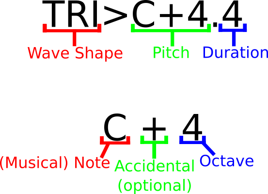

# Tones

Generate tones musically with the CLI. With this package, you can pass musical
notes via command line arguments and output them as audio and optionally write
them to a WAV file.

[![Java][java shield]][java website]
[![Apache Commons Cli][apache commons cli shield]][apache commons cli website]
[![JUnit5 Jupiter][junit 5 jupiter shield]][junit 5 jupiter website]
[![Hamcrest][hamcrest shield]][hamcrest website]
[![Mockito][mockito shield]][mockito website]
[![Gradle][gradle shield]][gradle website]
[![Kotlin][kotlin shield]][kotlin website]
![Git][git shield]
[![Github][github shield]][github repo]
[![MIT][mit shield]][mit website]

## Table of Contents

1. [Installation](#installation)
1. [Usage](#usage)
1. [Wave Shapes](#wave-shapes)
1. [Command Line Options](#command-line-options)
1. [Usage Example](#usage-example)
1. [Audio Operand Components](#audio-operand-components)

## Installation

(coming soon)

## Usage

The simplest usage is shown in the example below. A more intricate example is
shown in the [Usage Example section](#usage-example):

```bash
$tones C4.4 D3.4 E-5.2 ?.2 D4.2 C3.1
```

This would output a sine wave tone consisting of the following notes to whatever
the current OS's audio output is set to:

- C quarter note in the 4th octave &rightarrow; C&#9833;
- D quarter note in the 3rd octave &rightarrow; D&#9833;
- E flat half note in the 5th octave &rightarrow; E&flat;&#119134;
- a half rest (silence for duration of a half note) &rightarrow; &#119100;
- D half note in the 4th octave &rightarrow; D&#119134;
- C whole note in the 3rd octave &rightarrow; C&#119133;

## Wave Shapes

It's possible to generate tones with 5 different wave shapes. Each wave shape
can be represented via one or more case insensitive `String`s. The following
wave shapes and their strings are:

- Sine &acd;

  The `String`s for this wave shape are: `SIN` and `SINE`.

- Square &#9101;

  The `String`s for this wave shape are: `SQR` and `SQUARE`.

- Triangle &wedge;

  The `String`s for this wave shape are: `TRI` and `TRIANGLE`.

- Saw Up &#9727;

  The `String`s for this wave shape are: `SUP`, `SAWUP` and `SAW_UP`.

- Saw Down &#9722;

  The `String`s for this wave shape are: `SDN`, `SAWDOWN` and `SAW_DOWN`.

## Command Line Options

- `--bpm`, `b`

  Sets the bpm (beats per minute)/tempo of the audio. Expects a positive integer
  argument and defaults to `140`.

- `--help`, `-h`

  Ignores all other arguments and prints a help message about usage and the
  command line options and flags.

- `--note-beat-value`, `-n`

  Sets the beat value of a note. Expects a positive integer argument and
  defaults to `4`. The simplest way to think of this value is the bottom value
  of a time signature. So if there's a time signature of
  <sup>3</sup>&frasl;<sub>4</sub>, then `4` is the beat value of a note. This
  affects how the duration get's applied to a note and probably doesn't have to
  be manually set in most cases.

- `--out`, `-o`

  Outputs the audio to a 44.1khz/16bit WAV file. Expects a path (or filename)
  that doesn't point to a pre-existing file or directory. `.wav` is appended to
  the outputted file if it doesn't already contain a file extension.

- `--quiet`, `-q`

  Prevents audible output from being played.

- `--version`, `-v`

  Prints the version of the package.

- `--wave`, `-w`

  Sets the default wave shape to use for notes that don't have a wave shape
  specified. Expects a valid wave shape and defaults to `SINE`. The valid wave
  shapes can be found in the [Wave Shapes section](#wave-shapes) of this
  document.

## Usage Example

Below is a more intricate example relative to the simple example above:

```bash
$tones --bpm 135 --wave sup --silent --o sandstorm C4.4 tri>D3.4 SQR>E-5.2 E-4.2 sdn>D4.2 SIN>C3.1
```

This writes the audio of the following notes at 135 bpm to a 44.1khz/16bit WAV
file named `sandstorm.wav` in the current working directory without audibly
playing any audio:

- C quarter note sawtooth up wave in the 4th octave &rightarrow; C&#9833;
- D quarter note triangle wave in the 3rd octave &rightarrow; D&#9833;
- E flat half note square wave in the 5th octave &rightarrow; E&flat;&#119134;
- a half rest (silence for duration of a half note) &rightarrow; &#119100;
- D half note sawtooth down wave in the 4th octave &rightarrow; D&#119134;
- C whole note sine wave in the 3rd octave &rightarrow; C&#119133;

## Audio Operand Components

The primary command line operand arguments that are required to set the
synthesized sound are referred to as *audio string*s. An *audio string* is a
`String` that contains all the information needed to synthesize audio.

The below diagram breaks down the segments that an *audio string* is composed of.
The diagram also further breaks down the *pitch* segment of an audio string. The
*pitch* segment is the component of an *audio string* used to dictate the
frequency of the synthesized audio:

<details>
<summary>Audio Operand Components diagram</summary>

</details>

### Wave Shape prefix

  The first segment of an *audio string* sets what ***wave shape*** the audio
  will be. This segment can be omitted to use the default wave shape. Refer to the
  [Wave Shapes section](#wave-shapes) for the different wave shapes audio cna be.

### Pitch (or silence)

The pitch segment dictates the ***frequency*** the audio will be if it has
a timbre or if the audio is silence (and therefore has no timbre). This segment
itself is further composed of 3 components:

1. The leading ***note*** character consisting of one of the alpha characters A-G.
1. followed by the ***accidental***. The accidental character makes it so a note
can be a *sharp* &sharp; or *flat* &flat;. Or if it's a *natural* &natural;
(neither a *sharp* &sharp; nor a *flat* &flat;), then this character can be
omitted.
1. And then finally followed by the ***octave***. The octave is simply a non
negative integer (0 or greater) to set the octave the note that precedes is
in.

To create a silence, the pitch segment is simply a question mark character, `'?'`.

### Duration suffix

The final segment of an audio string is the ***duration***. The duration amount
is ***relative to the <u>note beat value</u> and <u>bpm/tempo</u>***. Without
these 2 additional bits of information (the note beat value and bpm/tempo) the
duration amount alone isn't enough information to extrapolate the actual span of
time the audio or silence should be played.

An easy way to think of it is that if the duration is integer *N*, then the
length of the note will be <sup>1</sup>&frasl;<sub>*N*</sub>. So, if *N* were 1,
then the duration would be <sup>1</sup>&frasl;<sub>1</sub> which would be a
whole note. If *N* were 4, that'd result in <sup>1</sup>&frasl;<sub>4</sub> so
it'd be a quarter note etc.

[java shield]: https://img.shields.io/badge/java%20JDK%2021-%23ED8B00.svg?style=for-the-badge&logo=openjdk&logoColor=white "Java JDK 21"
[java website]: https://docs.oracle.com/en/java/javase/21/docs/api/index.html "Java"
[apache commons cli shield]: https://img.shields.io/badge/Apache%20Commons%20CLI-D42029?style=for-the-badge&logo=apache&logoColor=white "Apache Commons CLI"
[apache commons cli website]: https://commons.apache.org/proper/commons-cli/ "Apache Commons CLI"
[junit 5 jupiter shield]: https://img.shields.io/badge/JUnit%205%20Jupiter-blue?style=for-the-badge "JUnit 5 Jupiter"
[junit 5 jupiter website]: https://junit.org/junit5/docs/current/user-guide/ "JUnit 5 Jupiter"
[hamcrest shield]: https://img.shields.io/badge/Hamcrest-teal?style=for-the-badge "Hamcrest"
[hamcrest website]: https://hamcrest.org/JavaHamcrest/ "Hamcrest"
[mockito shield]: https://img.shields.io/badge/Mockito-yellow?style=for-the-badge "Mockito"
[mockito website]: https://site.mockito.org/ "Mockito"
[gradle shield]: https://img.shields.io/badge/Gradle-02303A.svg?style=for-the-badge&logo=Gradle&logoColor=white "Gradle"
[gradle website]: https://gradle.org/ "Gradle"
[kotlin shield]: https://img.shields.io/badge/kotlin-%237F52FF.svg?style=for-the-badge&logo=kotlin&logoColor=white "Kotlin"
[kotlin website]: https://kotlinlang.org/ "Kotlin"
[git shield]: https://img.shields.io/badge/git-%23F05033.svg?style=for-the-badge&logo=git&logoColor=white "Git"
[github shield]: https://img.shields.io/badge/github-%23121011.svg?style=for-the-badge&logo=github&logoColor=white "Github"
[github repo]: https://github.com/SnapperGee/tones "Github"
[mit shield]: https://img.shields.io/badge/license-MIT-green?style=for-the-badge "MIT"
[mit website]: https://opensource.org/license/mit "MIT"
